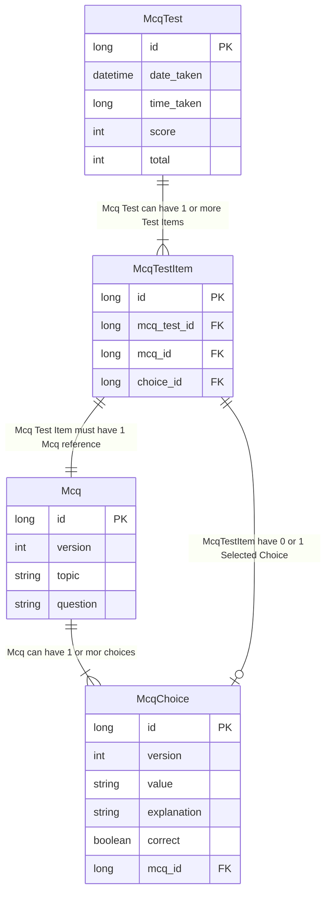

PRODUCTS:
  - quizzie
    - mcq
      - test
      - learn
    - flashcard
      - test 
      - learn
    - notes - summary
  - miscellaneous
    - timer
    - pomodoro


ERD


API
`API.java`
```java
@RestController
@RequestMapping("/mcq")
public class McqController {

  // add Query Params here, topic? no of items? timer?
  @GetMapping("/test")
  McqTest generateTest();

  @PostMapping("/test")
  McqTestResult submitTest(@RequestBody McqTestAnswer mcqTest);

  @GetMapping("/test/{id}")
  McqTestResult getTestResult(@PathVariable(name="id") Long id);

  @GetMapping("/questions/{topic}")
  List<Mcq> getQuestions(@PathVariable(name="topic") String topic);

  @PostMapping("/question")
  Mcq addMcq(@RequestBody Mcq mcq);

  @PostMapping("/question/{id}/choice")
  McqChoice addChoice(@RequestBody McqChoice choice);

  @PatchMapping("/question/{id}/choice")
  McqChoice updateChoice(@RequestBody McqChoice);

}

```